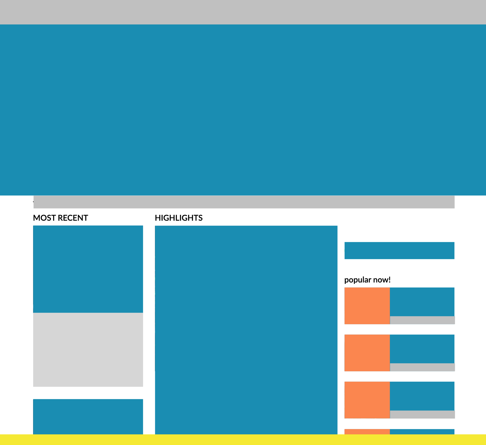

# Bootstrap CSS

En aquesta activitat replicaràs un disseny utilitzant **només** classes del _framework_ Bootstrap CSS.

## Objectius

- Fer funcionar Bootstrap CSS en un projecte HTML + CSS bàsic.
- Familiaritzar-se amb les classes de Bootstrap CSS.
- Entendre l'enfoc _component based_.
- Crear dissenys responsius mitjançant el sistema de files i columnes de Bootstrap CSS.

## Exercici

Per a aquesta activitat, has de replicar l'estructura d'una pàgina web existent tant bé com puguis. Pot ser una web de notícies, esports, blog... La pots triar tu.

No cal que afegeixis continguts (títols, imatges o textos) si no en tens temps, es tracta només de replicar l'estructura visual dels elements de la pàgina per "blocs".

Per a fer-ho, has d'utilitzar les classes del [_grid system_ de Bootstrap](https://getbootstrap.com/docs/5.1/layout/grid/) (`container`, `row`, `col-[ ]-[ ]`, etc.)

Si et cal fixar l'alçada d'alguns elements, pots fer-ho directament amb la propietat de CSS `height`.

Si vols, pots utilitzar textos _Lorem Ipsum_ per omplir blocs.

És recomanable utilitzar [classes d'utilitat](https://getbootstrap.com/docs/5.1/utilities/colors/) per tal de pintar els fons dels elements i així fer-los visibles (enlloc de deixar el fons blanc).

Has d'intentar replicar (tant com puguis) el comportament responsive de la web que estiguis duplicant.

> Tens un arxiu `index.html` que ja conté el Bootstrap carregat.

### Exemple:

Web original:

Rèplica de blocs amb Bootstrap CSS:

## Recursos

- [Bootstrap CSS](https://getbootstrap.com/)

## Notes

_Aquest és un projecte creat a [CodeOp](http://CodeOp.tech), al bootcamp de Front End Development a Barcelona._
